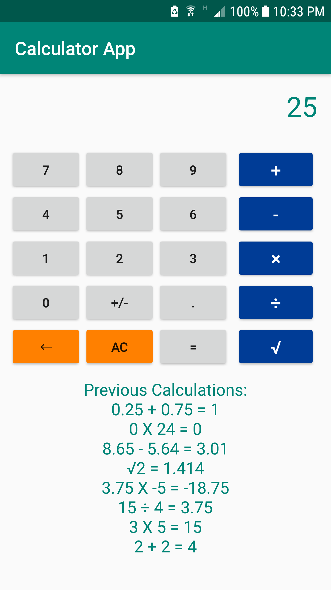

# Calculator App

Simple calculator to teach the basics of Android app development and working with a preexisting codebase through a project-based approach.

This skeleton repository was written for [FRC Team 25 - Raider Robotix](https://www.raiderrobotix.org/), and an experienced programmer should be working alongside those learning.

------------------------

**Prerequisites**

* Solid foundation of Java and object-oriented programming
* Basic knowledge of XML 
* Understanding of how Android app source files are structured
* Debugging skills
* [Android Studio](https://developer.android.com/studio/) with API level 24+
* [Git](https://git-scm.com/)
* Your own GitHub account

**Goals**

* Explore activities, layouts, and manifest files
* Understand basic linear and relative parameters
* Create layouts via XML and programatically
* Continue to develop algorithmic problem-solving skills
* Understand good material design and Android development practices
* Learn to expand and modify an existing codebase

More goals may be added as this repository evolves

------------------------

## Setup

To begin, [fork this repository](https://guides.github.com/activities/forking/) on GitHub.

Afterward, clone your fork onto your local machine after navigating to your desired directory:

```
git clone https://github.com/YOUR-USERNAME/CalculatorApp.git
```

Work through the TODO messages to fix bugs and add new features to the app. Tasks include:

- Modifying the manifest file so the correct main activity is launched
- Fixing layout parameters to follow material design guidelines
- Generating the remainder of the number buttons
- Adding buttons for subtraction and division
- Resolving minor bugs
- Implementing buttons for the number zero, decimal points, and plus/minus
- Ensuring good code practices are followed
- Adding buttons and views for additional functionality (e.g. undo, all clear, memory, enter, etc.)

Remember to track changed files and commit changes frequently:

```
git add -a
git commit -m "Your commit message here"
```

Refer to [these guidelines](https://gist.github.com/robertpainsi/b632364184e70900af4ab688decf6f53) when writing commit messages. Keep them short and sweet!

When you're done testing your code and you're sure it works, push it to GitHub (the remote):

```
git push origin master
```

That's it! Good luck!

-------------------------------

Here's a screenshot of what your finished app *could* look like:


